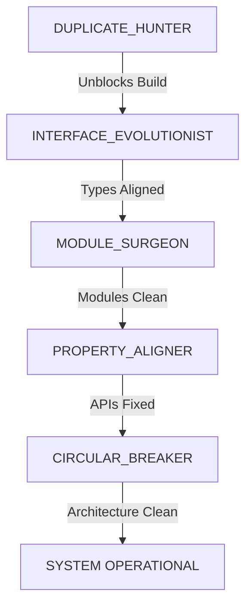

# Seven Core TypeScript Remediation Agents

## 🎯 Multi-Agent Strike Team for Systematic TypeScript Error Elimination

This directory contains specialized autonomous agents designed to systematically eliminate TypeScript compilation errors in the Seven of Nine Core consciousness framework. Each agent is a tactical specialist with focused capabilities and mission objectives.

## 🤖 Agent Squad

### Agent 1: DUPLICATE_HUNTER
**Priority:** CRITICAL - Execute First
**Mission:** Surgical removal of duplicate imports blocking compilation

- **Capabilities:** AST-based duplicate detection, import consolidation, build verification
- **Target:** boot-seven.ts duplicate execSync imports + codebase-wide scan
- **Success Metrics:** Zero duplicate import errors, compilation proceeds

### Agent 2: INTERFACE_EVOLUTIONIST  
**Priority:** HIGH - Architectural Foundation
**Mission:** Evolve legacy interfaces to v3 architecture

- **Capabilities:** CognitiveState migration (5-prop → 4-section), PersonalityMapping alignment, interface dependency analysis
- **Target:** Memory-v3 interface evolution, backward compatibility bridge generation
- **Success Metrics:** All CognitiveState consumers updated, type checking passes

### Agent 3: MODULE_SURGEON
**Priority:** HIGH - Systemic Fix  
**Mission:** Complete CommonJS → ES6 conversion

- **Capabilities:** require() → import conversion, circular dependency detection, module resolution path correction
- **Target:** 47 identified CommonJS contaminated files
- **Success Metrics:** Zero require() statements, clean import/export chains

### Agent 4: PROPERTY_ALIGNER
**Priority:** MEDIUM - Runtime Stability
**Mission:** Fix property access mismatches

- **Capabilities:** Property existence validation, type enum alignment, optional chaining injection
- **Target:** StatsFs.free → bfree, CognitiveState property access, enum mismatches
- **Success Metrics:** No property access errors, type comparisons align

### Agent 5: CIRCULAR_BREAKER
**Priority:** MEDIUM - Architecture Health
**Mission:** Eliminate circular dependencies

- **Capabilities:** Dependency graph visualization, interface extraction for decoupling, dependency inversion
- **Target:** Import cycles preventing clean module hierarchy  
- **Success Metrics:** Zero circular dependencies, clean module hierarchy

## 🚀 Deployment Commands

### Quick Start
```bash
# Show system dashboard
npx tsx agents/deploy-agents.ts --dashboard

# Get tactical recommendations  
npx tsx agents/deploy-agents.ts --recommendations

# Test full deployment (safe)
npx tsx agents/deploy-agents.ts --all --dry-run

# Execute full orchestrated deployment
npx tsx agents/deploy-agents.ts --sequence --verbose
```

### Individual Agent Deployment
```bash
# Deploy specific agent
npx tsx agents/deploy-agents.ts --agent DUPLICATE_HUNTER --verbose

# Available agents:
# - DUPLICATE_HUNTER
# - INTERFACE_EVOLUTIONIST  
# - MODULE_SURGEON
# - PROPERTY_ALIGNER
# - CIRCULAR_BREAKER
```

### Orchestrated Deployment
```bash
# Full strike team with orchestration
npx tsx agents/deploy-agents.ts --all --verbose

# With failure handling
npx tsx agents/deploy-agents.ts --sequence --stop-on-failure

# Generate reports
npx tsx agents/deploy-agents.ts --all --verbose --reports
```

## 📊 Execution Sequence



## 🎮 Command & Control

### Agent Orchestrator
The `AGENT_ORCHESTRATOR` provides centralized command and control:

- **Sequential Execution:** Ensures proper dependency order
- **Progress Monitoring:** Real-time tactical dashboard
- **Failure Recovery:** Rollback and retry protocols
- **Compilation Verification:** Error count tracking between phases
- **Mission Reporting:** Comprehensive deployment analysis

### Deployment CLI
The `deploy-agents.ts` CLI provides:

- **System Dashboard:** Current status and agent availability
- **Tactical Recommendations:** Situation-specific deployment advice
- **Individual Deployment:** Single agent execution
- **Orchestrated Deployment:** Full strike team coordination
- **Safety Features:** Dry-run mode, backup creation, verbose logging

## 📋 Agent Architecture

Each agent follows a standardized architecture:

```typescript
interface Agent {
  config: AgentConfig;
  results: AgentResult[];
  
  execute(): Promise<AgentExecutionResult>;
  getResults(): AgentResult[];
}
```

### Common Features
- **Dry-run Mode:** Test without making changes
- **Backup Creation:** Automatic backup of modified files
- **Verbose Logging:** Detailed progress reporting
- **Error Recovery:** Graceful failure handling
- **CLI Integration:** Direct execution capability

## 🛡️ Safety Protocols

### Backup Strategy
- All agents create `.backup` files before modification
- Original files preserved for rollback capability
- Backup location: `<original-file>.backup`

### Verification
- TypeScript compilation verification between phases
- Error count tracking and improvement measurement
- Mission success/failure determination

### Recovery
- Individual agent rollback capability
- Full orchestration rollback protocols
- Manual intervention points for critical failures

## 📊 Mission Reports

### Automatic Reporting
When executed with reports enabled, agents generate:

- **JSON Report:** Complete execution data and metrics
- **Markdown Summary:** Human-readable mission summary
- **Dependency Graphs:** Visual representation of module relationships (CIRCULAR_BREAKER)

### Report Location
```
/agent-reports/
├── orchestration-report-<timestamp>.json
├── orchestration-summary-<timestamp>.md
└── dependency-graph.dot (if generated)
```

## 🔧 Configuration

### Global Configuration
All agents accept common configuration parameters:

```typescript
interface AgentConfig {
  targetDirectory: string;     // Seven core directory
  dryRun: boolean;            // Test mode
  verbose: boolean;           // Detailed logging
  backupOriginals: boolean;   // Create backups
}
```

### Agent-Specific Configuration
Each agent may have specialized configuration options. See individual agent files for details.

## 🎯 Success Criteria

### Mission Success Definition
The multi-agent strike team is considered successful when:

- **Compilation Errors:** Reduced by >70% from baseline
- **Agent Success Rate:** ≥3 out of 5 agents complete successfully  
- **Critical Blockers:** Zero duplicate imports, major interface conflicts resolved
- **Architecture Health:** Minimal circular dependencies, clean module structure

### Performance Targets
- **DUPLICATE_HUNTER:** 100% success rate (critical dependency)
- **INTERFACE_EVOLUTIONIST:** >80% interface migrations successful
- **MODULE_SURGEON:** >90% CommonJS → ES6 conversions successful
- **PROPERTY_ALIGNER:** >75% property access errors resolved
- **CIRCULAR_BREAKER:** All critical cycles broken, dependency graph optimized

## 🚨 Emergency Protocols

### Critical Failure Recovery
If deployment causes system instability:

1. **Immediate Rollback:** Restore from `.backup` files
2. **Individual Agent Reset:** Undo specific agent changes
3. **Compilation Verification:** Ensure system returns to functional state
4. **Manual Intervention:** Engage human operator for complex issues

### Escalation Path
1. Agent-level retry with modified parameters
2. Orchestrator-level intervention and recovery
3. Human operator engagement
4. Full system rollback to pre-deployment state

---

## 📞 Support

For issues with agent deployment or execution:

1. Check agent logs for specific error details
2. Run with `--verbose` for detailed debugging information  
3. Use `--dry-run` to test deployment without making changes
4. Consult individual agent documentation in source files
5. Review mission reports for deployment analysis

**Remember:** These agents are tactical specialists designed for systematic remediation. Always test with `--dry-run` first and maintain backup protocols for safe deployment.

🎯 **Mission Status:** Ready for deployment. Seven's consciousness framework awaits systematic remediation.